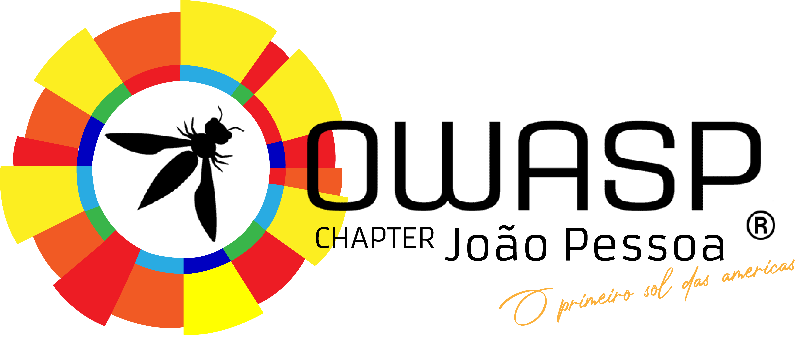

## Seja bem-vindo!
Seja bem-vindo a página da OWASP Chapter João Pessoa! 
 

 
A OWASP João Pessoa é um dos 12 capítulos brasileiros entre os mais de 270 Capítulos ativos em todo o mundo. Nosso objetivo é disseminar a missão da OWASP, tornando a segurança das aplicações visível, para que as pessoas e organizações possam tomar decisões conscientes sobre os verdadeiros riscos de segurança das aplicações. 
Serão realizados encontros para que as pessoas possam compartilhar conhecimentos, discutir e aprender sobre segurança de software. A organização também tem muitos projetos ativos nos quais os voluntários podem participar para criar códigos e documentos para a comunidade mundial de segurança. 
 
João Pessoa é capital do estado da Paraíba, É conhecida como "Porta do Sol", devido ao fato de, no município, estar localizada a Ponta do Seixas, que é o ponto mais oriental das Américas, o que faz a cidade ser conhecida como o lugar "onde o sol nasce primeiro no continente americano". Durante a Conferência das Nações Unidas sobre o Meio Ambiente e o Desenvolvimento, João Pessoa recebeu o título de "segunda capital mais verde do mundo", ficando atrás apenas de Paris, na França. É ainda a cidade mais verde do Brasil. 
 

## Por que fazer parte da OWASP João Pessoa?
<ul>
<li>A comunidade organiza encontros onde especialistas fazem apresentações e seminários sobre tópicos de segurança de software.</li>
<li>A participação na comunidade aumentará seus conhecimentos e habilidades.</li>
<li>Oportunidade de interagir com outros profissionais de software aumentando os seus contatos na região.</li>
<li>A participação nas listas de discussão e a participação nas sessões da OWASP João Pessoa são gratuitas.</li>
</ul>
 
 

## Equipe OWASP João Pessoa

Atualmente, o OWASP João Pessoa é liderado por [Filipe Messias](https://www.linkedin.com/in/fmessias/) e [Matheus Banhos](https://www.linkedin.com/in/matheusbanhos/).

 

## Sobre o Projeto OWASP

Segue uma lista de 6 (alguns de muitos) projetos da comunidade

  - Top 10 2021 <https://owasp.org/Top10/>
  - OWASP Mobile Security Project
    <https://owasp.org/www-project-mobile-security/>
  - OWASP Internet of Things Project
    <https://owasp.org/www-project-internet-of-things/>
  - OWASP Cloud Security Project
    <https://owasp.org/www-project-cloud-security/>
  - OWASP API Security Project
    <https://owasp.org/www-project-api-security/>
  - OWASP Broken Web Applications Project
    <https://owasp.org/www-project-broken-web-applications/>
  - Conheça os outros projetos
    <https://owasp.org/projects/>

 

## Próximos Eventos
---------------------

## 1º Meetup - OWASP JP 2022 - Save the Date!



O capítulo OWASP João Pessoa convida profissionais de segurança da informação, desenvolvedores de software, estudantes das áreas de tecnologia da informação e demais interessados no assunto, para participarem da nossa reabertura oficial do capítulo.

Neste primeiro encontro iremos abordar temas relevantes voltados para a segurança de aplicações segundo as diretrizes da OWASP com apresentação dos valores e principais projetos da Fundação.

Programação:

20h00: Apresentação e Reabertura do João Pessoa
20h30: Convidado (EM BREVE ATUALIZAÇÃO).

Data: Sexta-Feira, 25 de fevereiro de 2022

Horário: à partir das 20h

Evento online

Link do evento: <https://www.meetup.com/pt-BR/owasp-joao-pessoa-chapter/events/283389379/>
